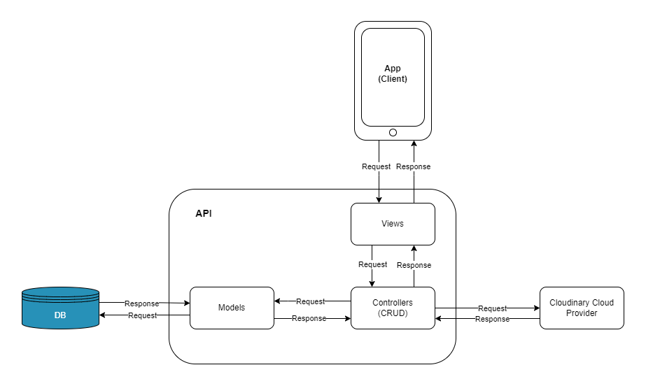

<div align="center" id="top">
  
  <br/>
    <br/>
  <h1>Activulse</h1>
  <p>
    "
    Empowering Heart Health and Wellness in Every Step with Activulse
  "
  </p>
    
  <span>Final College Project | [ESMAD](https://www.esmad.ipp.pt/?set_language=en) </span>
</div>

## Table of Contents

- [:bulb: About](#bulb-about)
- [:computer: Tech Stack](#computer-tech-stack)
- [:rocket: Getting Started](#rocket-getting-started)
- [:construction_worker_man: Architecture](#construction_worker_man-architecture)
- [:writing_hand: Documentation](#writing_hand-documentation-report-and-rest-api)
- [:link: Contact](#link-contact)

## :bulb: About

Activulse is a mobile app empowering heart health and wellness in every step with Activulse. With Activulse, you can track your distance traveled and daily steps, providing a clear and motivating view of your progress. Beyond just a fitness tracker, Activulse offers a variety of resources to support your heart health, including tailored exercise routines, nutrition advice, and yoga techniques to balance your mind and body.

Set and tackle physical activity goals aligned with WHO guidelines, pushing your limits to achieve new levels of fitness. Earn points and rewards by meeting daily goals, completing challenges, and unlocking achievements, making your journey to well-being both fun and rewarding. Additionally, delve into extensive cardiovascular health guides to understand symptoms, adopt heart-friendly habits, and gain the insights you need to take control of your heart health.

Embark on a transformative adventure towards a healthier, more vibrant life with Activulse. Your journey to improved cardiovascular well-being starts here!

## :computer: Tech Stack

The following Frameworks and Libraries were used in the development of this project:

- [React](https://reactjs.org/)
- [React Native](https://reactnative.dev/)
- [Expo](https://expo.dev/)
- [JavaScript](https://www.javascript.com/)
- [TypeScript](https://www.typescriptlang.org/)
- [NativeWind](https://www.nativewind.dev/)
- [Node.js](https://nodejs.org/)
- [Express](https://expressjs.com/)
- [Sequelize](https://sequelize.org/)
- [MySQL](https://www.mysql.com/)
- [Cloudinary](https://cloudinary.com/)

## :rocket: Getting Started

### Prerequisites

- [Node.js](https://nodejs.org/en/)\* (at least 18.18.0)
- [NPM](https://www.npmjs.com/)\* (at least 10.8.2)
- [Expo CLI](https://docs.expo.dev/workflow/expo-cli/)\*

* To run locally, you will need to have a MySQL database running on your machine or remotely on port 3306 (be sure to update the credientials in the `.env` file).

* You need `Expo CLI` installed on your machine. You can install it by running the following command:

```sh
npm install -g expo-cli
```

- To run the app on your phone, you will need to have the `Expo Go` app installed on your phone. You can download it from the [App Store](https://apps.apple.com/us/app/expo-go/id982107779) or [Google Play](https://play.google.com/store/apps/details?id=host.exp.exponent&hl=en&gl=US). Scan the QR code generated by the `npm start` command to run the app on your phone.

- To run the app on an emulator, you will need to have the Android Studio installed on your machine. You can download it from the [Android Studio website](https://developer.android.com/studio). Check out [React Native Setup](https://reactnative.dev/docs/set-up-your-environment) for more information on how to set up your environment to run the app on an emulator.

### Installation

#### Automated (experimental)

1. Clone the repo

2. Run the setup script (use the correct script for your OS)

##### Linux or MacOS

```sh
chmod +x ./scripts/setup-project.sh && ./scripts/setup-project.sh
```

##### Windows

```sh
./scripts/setup-project.bat
```

3. Create a `.env` file in the following directories:

- `/packages/api`
- `/packages/app`

And follow the `.env.example` file in each directory to fill in the required environment variables.

4. Run the project (use the correct script for your OS)

##### Linux

```sh
chmod +x ./scripts/start-project.sh && ./scripts/start-project.sh
```

If you get an error saying that a command was not found, edit the `start-project.sh` file and add your current terminal to the list of terminals (line 3).

###### Example

```sh
local terminals=("x-terminal-emulator" "gnome-terminal" "konsole" "YourTerminal")
```

To find out the name of your terminal, run the following command:

```sh
ps -p $(ps -p $$ -o ppid=) -o comm=
```

##### MacOS

```sh
chmod +x ./scripts/macos-start-project.sh && ./scripts/macos-start-project.sh
```

##### Windows

```sh
./scripts/start-project.bat
```

#### Manual

1. Clone the repo

2. Install NPM packages

```sh
  cd packages/api
  npm install

  cd ../app
  npm install

```

3. Create a `.env` file in the following directories:

- `/packages/api`
- `/packages/app`

And follow the `.env.example` file in each directory to fill in the required environment variables.

4. Start the database

```sh
cd packages/api
npm run db
```

5. Start the API

```sh
cd packages/api
npm run dev
```

6. Start the app

```sh
cd packages/app
npm start
```

## :construction_worker_man: Architecture



## :writing_hand: Documentation (Report and Rest API)

_will be added the english version and the portuguese version of the report developed for the project soon_

_The Rest API documentation will be added soon (working in progress developed with Swagger UI )_

## :link: Contact

Created by Pedro Teixeira

LinkedIn: [https://www.linkedin.com/in/pedromst2000](https://www.linkedin.com/in/pedromst2000)

Email: pedromst2000@gmail.com

<br />

<p align="center">
 <a href="#top">Back to top</a>
</p>
