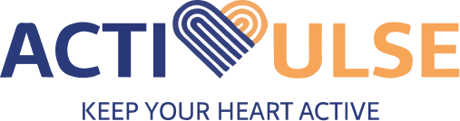
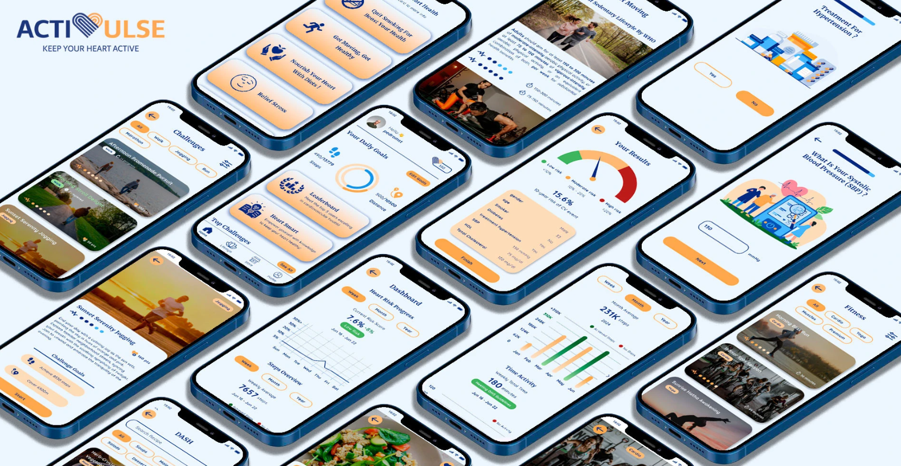
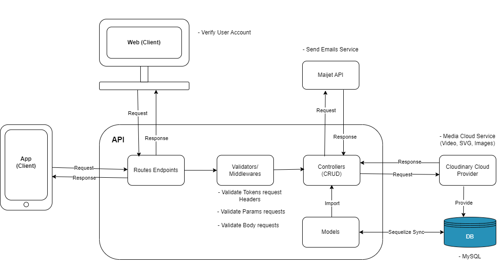
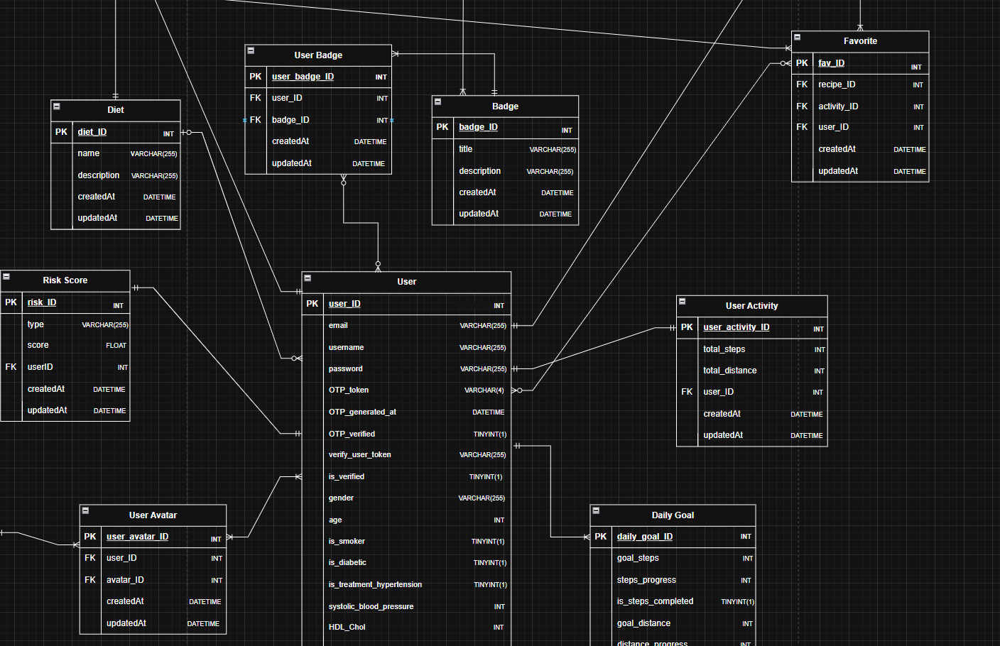

<div align="center" id="top">
  
  <br><br>

  <p>
    "Empowering Heart Health and Wellness in Every Step with Activulse"
  </p>

  <br>

  <p>
    <a href="https://github.com/pedromst2000/Activulse/issues/new?labels=bug&template=bug_report.md">Report Bug</a>
    ·
    <a href="https://github.com/pedromst2000/Activulse/issues/new?labels=enhancement&template=feature_request.md">Request Feature</a>
  </p>

<span>Final College Project | [ESMAD](https://www.esmad.ipp.pt/?set_language=en) </span>

</div>

## Table of Contents

- [:bulb: About](#bulb-about)
  - [Key Features](#key-features)
  - [References](#references)
    - [Cardiovascular Risk Assessment - Framingham Risk Score](#heart-cardiovascular-risk-assessment---framingham-risk-score)
    - [Health Literacy & Primary Prevention of Cardiovascular Risk](#book-health-literacy--primary-prevention-of-cardiovascular-risk)
    - [Physical Activity Guidelines](#running-physical-activity-guidelines)
    - [Scientific Databases, Journals & Research Organizations](#microscope-scientific-databases-journals--research-organizations)
    - [Cardiovascular Organizations](#cardiovascular-organizations)
    - [Health Authorities](#health-authorities)
- [:video_camera: Demo Video](#video_camera-demo-video)
- [:art: UI Preview](#art-ui-preview)
  - [Poster](#poster)
- [:computer: Tech Stack](#computer-tech-stack)
- [:construction_worker_man: Architecture and Data Model](#construction_worker_man-architecture-and-data-model)
  - [Application Architecture](#application-architecture)
  - [Database Model](#database-model)
- [:rocket: Getting Started](#rocket-getting-started)
- [:writing_hand: Documentation and Deploy](#writing_hand-documentation-and-deploy)
  - [Report](#report)
  - [Live API](#live-api)
- [:handshake: Contributing](#handshake-contributing)
- [:page_facing_up: License](#page_facing_up-license)
- [:writing_hand: Final Reflections](#writing_hand-final-reflections)

## :bulb: About

Activulse is a cross-platform [React Native](https://reactnative.dev/) app that empowers users to take control of their heart health through intelligent risk assessment, personalized activity tracking, and evidence-based wellness guidance. Developed as a bachelor's final project at **[ESMAD](https://www.esmad.ipp.pt/?set_language=en)** (TSIW program), it was created alongside **[academic research](https://app.luminpdf.com/viewer/69c331e265663ae8f32d2968)** in collaboration with **[ESS](https://www.ess.ipp.pt/)** to validate the health problem, align implementation with clinical best practices, and ensure evidence-based feature design.

### Key Features

- :heart: **Cardiovascular Risk Assessment** - Framingham Risk Score calculation for personalized risk stratification
- :footprints: **Smart Activity Tracking** - Step counting, daily goals, challenges, and gamification with reward badges and leaderboards. Earn points through daily goals and activities!
- :fork_and_knife: **Personalized Nutrition** - Dietary recommendations (Mediterranean, DASH, Vegan)
- 🧘🏻‍♀️ **Fitness & Wellness** - Exercises, yoga, and WHO-aligned physical activity guidance
- :bar_chart: **Health Dashboard** - Visual progress tracking and cardiovascular risk evolution
- :book: **Evidence-Based Guidance** - Educational content on heart health, lifestyle, and prevention

### References

The project is grounded in extensive research from peer-reviewed literature and clinical guidelines. Below are the **main references** supporting key features - the full research database includes numerous additional sources across cardiovascular health, nutrition, physical activity, and behavioral science.

#### :heart: Cardiovascular Risk Assessment - Framingham Risk Score

- Framingham Heart Study - 10-Year CVD Risk Prediction: https://www.framinghamheartstudy.org/fhs-risk-functions/cardiovascular-disease-10-year-risk/
- Validation Study on Risk Stratification: https://www.ahajournals.org/doi/10.1161/JAHA.121.024913
- Clinical Guidelines Reference: https://www.thieme-connect.de/products/ejournals/abstract/10.1055/s-0044-1782528
- Algorithm Implementation: [RiskScore.utils.js](https://github.com/pedromst2000/Activulse/blob/master/Packages/Api/src/utils/RiskScore.utils.js)

#### :book: Health Literacy & Primary Prevention of Cardiovascular Risk

- Health Literacy in Heart Disease Prevention: https://www.cardiosmart.org/news/2018/6/health-literacy-is-critical-to-heart-disease-prevention
- Mediterranean Diet and Cardiovascular Prevention: https://www.mdpi.com/2072-6643/10/1/58
- Sedentary Behavior and Cardiovascular Prevention: https://www.mdpi.com/1660-4601/20/1/532

#### :running: Physical Activity Guidelines

- WHO Guidelines on Physical Activity and Sedentary Behavior: https://iris.who.int/server/api/core/bitstreams/9e776de6-adc7-46c1-936f-6dd2bb4f7373/content

#### :microscope: Scientific Databases, Journals & Research Organizations

[](https://www.acc.org/) · [](https://www.ahajournals.org/) · [](https://www.escardio.org/) · [](https://www.mdpi.com/) · [](https://link.springer.com/brands/bmc) · [](https://www.who.int/) · [](https://diabetes.org/) · [](https://www.elsevier.com/) · [](https://www.cuf.pt/)

#### :hospital: Cardiovascular Organizations

[](https://www.fpcardiologia.pt) · [](https://sphta.org.pt/)

#### :office: Health Authorities

[](https://www.dgs.pt/) · [](https://www.sns.gov.pt/)

## :video_camera: Demo Video

<div align="center">
  <p>
    <a href="https://www.youtube.com/watch?v=8yQINRjBj68" target="_blank" rel="noopener noreferrer">
      
    </a>
  </p>
  <p>
    <a href="https://www.youtube.com/watch?v=8yQINRjBj68" target="_blank" rel="noopener noreferrer">
      
    </a>
  </p>
</div>

## :art: UI Preview

<div align="center">
  <p>
 <br>
    <a href="https://www.behance.net/gallery/234041863/Activulse-App" target="_blank" rel="noopener noreferrer">
      
    </a>
  </p>
  <p>
    <a href="https://www.behance.net/gallery/234041863/Activulse-App" target="_blank" rel="noopener noreferrer">
      
    </a>
  </p>
</div>

### Poster

The poster was designed to present the app's identity and goals at a glance, highlighting the main features, the core tools used, and the UI mockups that define the visual direction of Activulse. It is available for download on Google Drive.

[](https://drive.google.com/file/d/1b5V4QSS77OdXd-iGIB4Y6VQ3tA1iDuYQ/view?usp=sharing)

## :computer: Tech Stack

The stack was chosen to support a clean cross-platform UI, a typed codebase, and a secure backend with structured persistence.

### Frontend

[](https://expo.dev/)
[](https://reactnative.dev/)
[](https://reactjs.org/)
[](https://www.typescriptlang.org/)
[](https://tanstack.com/query/latest)
[](https://www.nativewind.dev/)
[](https://lottiefiles.com/)

- **Expo** and **React Native** power the mobile experience.
- **React** and **TypeScript** keep the UI predictable and maintainable.
- **React Query** handles server state and data synchronization.
- **NativeWind** provides utility-first styling across the app.
- **Lottie** is used for the splash screen animation and motion details.

### Web Client

[](https://vite.dev/)
[](https://reactrouter.com/)

- **Vite** keeps the web client fast and lightweight.
- **React Router** organizes the navigation flow.

### Quality & Tooling

[](https://eslint.org/)
[](https://prettier.io/)

- **ESLint** enforces code quality and consistency.
- **Prettier** keeps formatting aligned across the repository.

### Backend, Auth & Data

[](https://expressjs.com/)
[](https://jwt.io/)
[](https://github.com/kelektiv/node.bcrypt.js)
[](https://swagger.io/)
[](https://www.npmjs.com/package/mysql2)
[](https://sequelize.org/)
[](https://cloudinary.com/)

- **Express** powers the REST API.
- **JWT** and **bcrypt** handle secure authentication.
- **Swagger** exposes the API documentation.
- **MySQL2** and **Sequelize** manage persistence and data access.
- **Cloudinary** stores and serves media assets.

## :construction_worker_man: Architecture and Data Model

The project is organized around a layered backend and a separate data model that documents the database relationships.

### Application Architecture

The application follows a simple flow:

- Models handle persistence logic through Sequelize.
- Controllers expose the business logic through Express.
- Views render the React Native interface.

[](./images/Architecture.png)



### Database Model

The database model is shown as a DER preview so the main entities and relationships stay readable at a glance.

<div align="center">
  <p>
  <br>
    <a href="https://viewer.diagrams.net/?tags=%7B%7D&lightbox=1&highlight=0000FF&edit=_blank&layers=1&nav=1&title=ActivulseDB.drawio&dark=auto#Uhttps%3A%2F%2Fdrive.google.com%2Fuc%3Fid%3D1C0cQEVIfZPICy71SqsGCnoju2ym_0VQ-%26export%3Ddownload" target="_blank" rel="noopener noreferrer">
      
    </a>
  </p>
  <p>
    <a href="https://viewer.diagrams.net/?tags=%7B%7D&lightbox=1&highlight=0000FF&edit=_blank&layers=1&nav=1&title=ActivulseDB.drawio&dark=auto#Uhttps%3A%2F%2Fdrive.google.com%2Fuc%3Fid%3D1C0cQEVIfZPICy71SqsGCnoju2ym_0VQ-%26export%3Ddownload" target="_blank" rel="noopener noreferrer">
      
    </a>
  </p>
</div>

## :rocket: Getting Started

### Prerequisites

- [Node.js](https://nodejs.org/en/)\* (at least 18.18.0)
- [NPM](https://www.npmjs.com/)\* (at least 10.8.2)
- [Expo CLI](https://docs.expo.dev/workflow/expo-cli/)\*

* To run locally, you will need a MySQL database running on your machine or remotely on port 3306. Update the credentials in each `.env` file before starting the project.

* You need **Expo CLI** installed on your machine. You can install it by running the following command:

```sh
npm install -g expo-cli
```

- To run the app on your phone, you will need to have the `Expo Go` app installed on your phone. You can download it from the [App Store](https://apps.apple.com/us/app/expo-go/id982107779) or [Google Play](https://play.google.com/store/apps/details?id=host.exp.exponent&hl=en&gl=US). Scan the QR code generated by the `npm start` command to run the app on your phone.

- To run the app on an emulator, you will need to have the Android Studio installed on your machine. You can download it from the [Android Studio website](https://developer.android.com/studio). Check out [React Native Setup](https://reactnative.dev/docs/set-up-your-environment) for more information on how to set up your environment to run the app on an emulator.

### Installation

#### Automated (experimental)

1. Clone the repo

2. Run the setup script (use the correct script for your OS)

##### Linux or MacOS

```sh
chmod +x ./scripts/setup-project.sh && ./scripts/setup-project.sh
```

##### Windows

```sh
./scripts/setup-project.bat
```

3. Create a `.env` file in the following directories:

- `/Packages/Api`
- `/Packages/App`
- `/Packages/Web`

Follow the `.env.example` file in each directory to fill in the required environment variables.

4. Run the project (use the correct script for your OS)

##### Linux

```sh
chmod +x ./scripts/start-project.sh && ./scripts/start-project.sh
```

If you get an error saying that a command was not found, edit the `start-project.sh` file and add your current terminal to the list of terminals (line 3).

###### Example

```sh
local terminals=("x-terminal-emulator" "gnome-terminal" "konsole" "YourTerminal")
```

To find out the name of your terminal, run the following command:

```sh
ps -p $(ps -p $$ -o ppid=) -o comm=
```

##### MacOS

```sh
chmod +x ./scripts/macos-start-project.sh && ./scripts/macos-start-project.sh
```

##### Windows

```sh
./scripts/start-project.bat
```

#### Manual

1. Clone the repo

2. Install NPM packages

```sh
cd Packages/Api
npm install

cd ../App
npm install

cd ../Web
npm install


```

3. Create a `.env` file in the following directories:

- `/Packages/Api`
- `/Packages/App`
- `/Packages/Web`

Follow the `.env.example` file in each directory to fill in the required environment variables.

4. Reset the database

```sh
cd Packages/Api
npm run reset-db
```

5. Start the API

```sh
cd Packages/Api
npm run dev
```

6. Start the app

```sh
cd Packages/App
npm start
```

7. Start the Web Client

```sh
cd Packages/Web
npm run dev
```

## :writing_hand: Documentation and Deploy

### Report

[](https://app.luminpdf.com/viewer/69c331e265663ae8f32d2968)

### Live API

| Resource           | Link                                                                                                                                                                        | Status                                                                                                                                      |
| ------------------ | --------------------------------------------------------------------------------------------------------------------------------------------------------------------------- | ------------------------------------------------------------------------------------------------------------------------------------------- |
| Base URL           | [](https://activulse.onrender.com/api-activulse/v1)           | [](https://activulse.onrender.com/api-activulse/v1)      |
| API Docs (Swagger) | [](https://activulse.onrender.com/api-activulse/v1/docs) | [](https://activulse.onrender.com/api-activulse/v1/docs) |

## :handshake: Contributing

We love your input! We want to make contributing to Activulse as easy and transparent as possible, whether it's:

- Reporting a bug
- Discussing the current state of the code
- Submitting a fix
- Proposing new features
- Becoming a maintainer

**[See the Contributing Guidelines](./.github/CONTRIBUTING.md)** for detailed instructions on how to contribute, naming conventions, workflow, and more.

## :page_facing_up: License

This project is licensed under the **MIT License**.

See the [LICENSE](https://github.com/pedromst2000/Activulse/blob/master/LICENSE.md) file for details.

## :writing_hand: Final Reflections

Activulse is the kind of project that only works when design, backend structure, and academic rigor move together. It started as a degree requirement and ended up as a complete product story, which is the part I value most.

The main challenge was researching a complex health domain and turning that knowledge into an app that met the project requirements without introducing implementation mistakes. That process demanded constant validation to ensure the features aligned with the research and with the intended scope.

More than delivering a final project, this work became a practical exercise in growth. It pushed me to learn a new area, strengthen my technical judgment, and understand how much careful research matters when building software for health.

<p align="center">
 <a href="#top">⬆️ Back to top</a>
</p>
